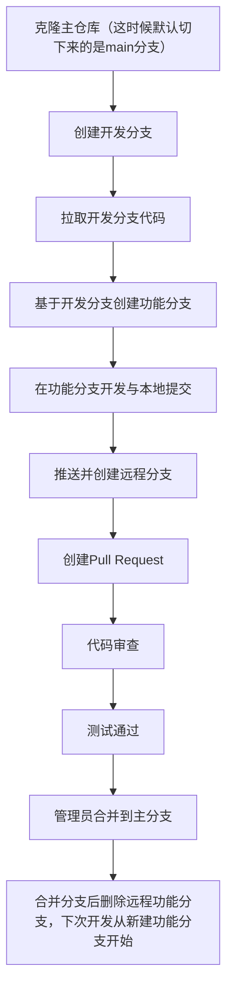

# 开发协作手册模板

## 项目名称：`[任后台管理系统]`

---

## 🏁 项目概述
**项目目标**：  
`[打造一个低学习曲线、直观易用的后台管理系统，使开发人员能迅速投入实际使用。]`

**技术栈**：

```
- 后端：Java 17+, Spring Boot 3.2.0, SpringSecurity, thymeleaf, Quartz
- 前端：Node.js 18.0+, Vite 6.2.4, Vue3.5.13, Vue Router 4, Pinia, ElementPlus、Ant Design Vue, TypeScript 
- 数据库：MySQL 8.0+, Redis 6.0+
```

---

## 💻 开发环境配置

### 必要环境
| 工具    | 最低版本      | 说明                                                         |
| ------- | ------------- | ------------------------------------------------------------ |
| JDK     | JDK 17+       | Spring Boot 3.x+ 要求 JDK 17+(Spring Security 6 支持Java 17基线) |
| Maven   | 3.8+          | 依赖管理工具（支持新版本依赖声明）                           |
| Node.js | 18.0+         | 前端工程化的底层引擎                                         |
| MySQL   | 8.0+          | 兼容 mysql-connector-java:8.0.30                             |
| Redis   | 6.0+          | 支持 Spring Data Redis 最新特性                              |
| Git     | 2.35+         | 版本管理工具                                                 |
| IDE     | IntelliJ IDEA | 开发工具                                                     |

### 项目初始化

#### 克隆项目

```shell
git clone https://gitee.com/huimouyixiaojifeigoutiao/Ren.git
#或
git clone https://github.com/by-ren/Ren.git
```

#### 后端启动

```bash
#注意根据自己下载的项目路径，调整命令
cd Ren-Demo/ren-admin

# 安装依赖
mvn clean install

# 启动应用
mvn spring-boot:run
```

#### 前端启动

```shell
# 进入前端项目根目录
cd ren-ui
# 安装前端依赖
npm install
# 运行项目
npm run dev
```

---

## 项目结构

**后台**

```
Ren-Demo/
├── ren-admin			    # 项目启动的主启动类与控制层所处模块
├── ren-business			# 业务总模块
│   ├── ren-example			# 业务示例模块（本模块无实际功能，仅作为代码规范示例使用，方便二次开发者参照，可删除）
│   ├── ren-localstorage	# 本地上传图片模块
├── ren-common			    # 通用模块（主要用于存放各个模块通用内容，如常量类，公共控制器，通用实体、VO、BO类，注解，配置文件，工具类）
├── ren-feature			    # 可插拔功能模块
│   ├── ren-cloudstorage	# 云上传图片模块（注意：该模块虽可独立使用，配套上传组件与数据库表分别为/ImageUpload/index.vue、sys_image_log，另外，如要使用该模块，请自行申请相关账号配置，并在主模块中放开该模块的引入）
├── ren-framework			# 核心模块（主要用于存放系统核心业务，如AOP切面，拦截器，监听器，通用接口以及权限认证等内容）
├── ren-monitor				# 监控模块，存放监控模块所有内容
├── ren-quartz				# 定时任务，存放定时任务所有内容
└── ren-system				# 系统模块，存放系统模块所有内容 
```

**前台**

```
ren_demo/
├── build                        # 构建相关  
├── bin                          # 执行脚本
├── public                       # 公共文件
│   └── favicon.ico              # favicon图标
├── src/
│   ├── api			    	    # 存放所有后台请求接口
│   ├── assets				    # 存放前端静态资源
│   ├── axios				    # 存放异步请求相关内容
│   ├── components				# 自定义可复用的Vue组件
│   ├── hooks				    # 主要用于存放VUE3的组合式API的
│   ├── layout				    # 主要用于存放布局文件内容
│   ├── router				    # 主要用于存放路由相关内容
│   ├── stores				    # 主要用于存放Pinia本地数据相关内容
│   ├── styles				    # 主要用于存放前端样式文件
│   ├── types				    # 主要用于存放TS类文件
│   ├── utils				    # 主要用于存放前端所需工具类
│   ├── views				    # 页面文件主文件夹
│   ├── App.vue					# 入口页面
│   └── main.ts					# 入口 加载组件 初始化等
├── .env.development			# 开发环境配置
├── .env.production				# 生产环境配置
├── .env.staging				# 测试环境配置
├── .gitattributes				# 定义Git如何处理特定文件（如换行符）
├── .gitignore					# git 忽略项
├── .prettierrc					# 代码格式化工具配置文件
├── auto-imports.d.ts		     # 自动导入的组件/API的类型声明文件
├── components.d.ts			     # 全局组件的TypeScript类型声明
├── index.html					# 应用入口,唯一HTML文件
├── package.json				# 项目身份证,依赖/脚本/元数据
│   ├── .editorconfig		     # 统一团队代码风格（缩进/字符集等）
│   ├── eslint.config.ts		 # TypeScript版的ESLint代码检查规则    	    
│   └── package-lock.json		 # 锁定依赖版本，确保安装一致性	    
├── README.md					# 说明文档
├── tsconfig.json			     # TypeScript总配置
│   ├── env.d.ts			     # 环境变量类型声明
│   ├── tsconfig.app.json	      # 应用代码编译配置
│   └── tsconfig.node.json		  # Node环境（如vite.config）类型配置
└── vite.config.js				 # 项目心脏,构建/开发服务器配置
```

## 📐 代码规范

### 基础编码风格
- 命名规范
  - 变量/函数：小驼峰 getUserInfo
  - 类/构造器：大驼峰 UserService
  - 常量：全大写 MAX_COUNT

- 缩进与空格
  - 统一缩进：2空格（Web前端）或 4空格（Java）
  - 操作符两侧空格：count = 1 + 2

- 行尾与空行
  - 方法/逻辑块间保留1行空白


### 设计原则

- 遵循开闭原则，扩展而非修改
- 重复逻辑封装为函数/工具类（例如一长段代码需要复制粘贴的时候，就是需要封装的时候）
- 防御性编程，判空处理，例如StringUtils.isNotBlank，ObjUtil.isNotNull

### 安全规范

- 禁止拼接SQL（必须使用PreparedStatement）

  - ```javascript
    // 反例：SQL注入风险（Java示例）
    String sql = "SELECT * FROM users WHERE id = " + userInput;
    
    // 正例：预编译语句
    PreparedStatement stmt = conn.prepareStatement("SELECT * FROM users WHERE id = ?");
    stmt.setInt(1, userInput);
    ```

- 长段可能会出现异常的代码，请放在Service层，并使用@Transactional，进行回滚，另外尽量指定回滚条件，如@Transactional(rollbackFor = {Exception.class})

### 语言约束

- Java

  - 类与方法命名，请遵循大驼峰命名法
  - 接口名前缀不加I，例如UserService，接口实现类在接口名后加Impl，如UserServiceImpl

  - 避免魔法数字（用常量代替 if (status == 1) → STATUS_ACTIVE）
  - 常量统一管理，常量尽量放在一个包内（common模块，/domain/constant），根据常量的功能不同进行文件拆分，如AppConstants

  - 请根据功能进行分模块，如ren-system模块是用于管理用户，角色，部门等，ren-monitor用于系统的监控模块，除可插拔模块与特殊模块外，其他的业务模块仅存储实体类、接口、接口实现、Mapper、Mapper.xml，具体的层级请参考已存在模块
    - 注意：分模块时根据模块功能不同放在不同位置
      - 例如如果是系统级的模块，放在根目录中，如system、monitor、quartz
      - 如果是业务级模块，则放在ren-business下作为子模块存在，例如localstorage、order
      - 如果是可插拔的功能类型的模块，则放在ren-feature模块下，例如ren-cloudstorage，请注意该模块下的所有内容需要满足无需依赖其他模块即可单独使用
    - 其中ren-common、ren-framework为两个特殊模块，不时每个模块的具体业务实现，而是存放项目通用功能以及核心功能，
      - common模块存放项目通用controller、实体类、枚举类、异常类、注解类，Manager（不是纯静态方法，参与了业务逻辑的计算的工具类），properties（读取配置文件的类），utils（静态方法工具类）
      - framework主要存储aop切面内容，config配置类（如RedisConfig），factory工厂类，security（SpringSecurity的实现）
    - **注意：模块与模块之间不允许循环依赖，拖慢项目运行速度**
  - 除可插拔模块外，其他所有模块的Controller统一放在admin模块中管理，使用不同包进行分类
  - 特殊类的命名与所代表功能
    - DO：和数据库对应的完整对象，包含数据库表中所有数据
    - DTO：不和数据库完全对应的对象，例如数据库查询出的内容只需要展示部分的情况，用DTO命名
    - VO：特殊的DTO，例如数据库查询出的东西不是直接返回，而是需要经过处理才能返回，则用VO（例如数据库时间存储为时间戳，而前端需要时间字符串，这时候需要把时间戳转为时间字符串，就用到了VO）（内部可以有格式化处理逻辑）
    - BO：业务对象（内部拥有复杂的业务处理逻辑的类属于BO）
    - Manager：不是纯静态方法，参与了业务逻辑的计算的工具类
    - utils：自定义的工具类
  - 项目中的工具类
    - 该项目中引入了Hutools作为工具类库，所以大家如果扩展开发，尽量也使用该包下的工具类，保证项目的一致性与简易性，另外，如果有一些Jar自带的工具类中方法不足够，需要自定义，可以使用自建工具类+继承Jar包工具类的方式进行编写（如Stringutils是自定义工具类，他继承了Hutools的StrUtil），但是如果使用了自建工具类+继承Jar包工具类的方式，那么该项目中无论是使用自定义工具方法还是Jar内的工具方法，请尽量都使用自定义工具类进行调用，例如StrUtil.isNotBlank由于Stringutils继承了StrUtil，所以该项目中所有使用该方法的地方都改为Stringutils.isNotBlank
  - 请保证项目中每一个方法上方都有准确而简练的注释，可以让其他人员快速了解该方法以及该类的作用，另外如果一个方法中逻辑比较繁琐，请尽量在必要位置添加注释，保证代码阅读性
  - 项目代码格式化：本条仅作为建议，如果可以，请大家在开发完成之后使用IDEA插件（Adapter for eclipse Code Formatter）进行格式化后上传，格式化模板文件已提供，请自行下载

- Vue

  - 视图组件，遵循文件夹加大驼峰文件名，例如/user/Index.vue、user/Detail.vue

  - 可复用组件，遵循文件夹加小驼峰文件名，例如ImageUpload/index.vue，方便自动导入组件的导入，例如ImageUpload/index.vue会被自动导入成<ImageUpload>组件，可直接使用，无需在每个文件中导入

  - 避免 v-if 与 v-for 混用

    - ```vue
      <!-- 错误示范 -->
      <div v-for="item in list" v-if="item.visible"></div>
      <!-- 正确方案 -->
      <template v-for="item in list">
        <div v-if="item.visible" :key="item.id"></div>
      </template>
      ```

  - 项目代码格式化：本条仅作为建议，如果可以，请大家在开发完成之后使用Prettier进行格式化，保证代码的风格一致性

- JavaScript

  - 禁用 var（强制 let/const）

  - 箭头函数代替 function

  - 优先解构赋值 const { id } = user

---

## 🔄 Git协作流程

### 标准工作流


### 用到的Git命令

```shell
# 1.克隆仓库
git clone https://github.com/project/repo.git
# 2.获取所有远程分支信息
git fetch origin
# 3.创建本地develop分支并关联远程
git checkout -b develop origin/develop
# 4.确保获取最新代码
git pull origin develop
# 5.基于develop创建新功能分支
git checkout -b feature-login
# 6.进行代码修改...
# 7.添加到Git暂存
git add .
# 8.提交到本地仓库
git commit -m "添加登录功能"
# 9.推送分支（远程自动创建同名分支）
git push origin feature-login
# 10.托管平台上创建Pull Request
# 11.选择源分支：feature-login
# 12.选择目标分支：develop
# 13.填写PR描述
# 14.管理员/团队成员审查代码
# 15.点击"Merge"按钮完成合并
# 16.代码自动进入develop分支
# 17.删除远程功能分支（新功能开发从第4步重新开始）
```


---

## ✍️ 代码提交规范

### 提交信息格式
```
类型(范围): 简要描述

详细描述（可选）

关联Issue: #123
```

### 类型说明
| 类型     | 描述       |
| -------- | ---------- |
| feat     | 新功能     |
| fix      | bug修复    |
| docs     | 文档变更   |
| style    | 代码格式化 |
| refactor | 重构代码   |
| test     | 测试用例   |

**示例**：
```
feat(payment): 增加PayPal支付支持

- 实现PayPal支付API对接
- 添加支付结果回调处理
- 更新支付文档

关联Issue: #45
```

---

## 🌿 分支策略

### 分支结构
```
main         # 生产环境稳定分支
develop      # 功能分支
│
├── feat/*   # 功能开发分支
├── fix/*    # bug修复分支
└── hotfix/* # 紧急修复分支
```

### 分支命名规范
```
feat/user-profile
fix/login-validation
hotfix/payment-timeout
```

---

> 📌 **重要提示**：  
> 请每位新成员在开始开发前：
>
> 1. 通读本手册
> 2. 完成开发环境配置验证

欢迎加入项目开发！🚀  
有疑问请联系：`wy18434294023@163.com`